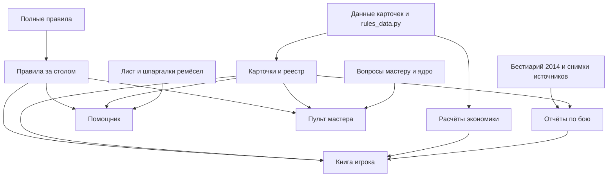

# Собрать и проверить проект

Codex, 09.10.2026. Техническая инструкция по текущим сборщикам.

**Как читать.** Для проверки ветки используй одну команду ниже. Для изменения документа найди его исходник в таблице. Правила совместной работы — в [AGENTS.md](../AGENTS.md).

## Проверить всё одной командой

```bash
python3 -B scripts/check_all.py --slow --browser
```

Команда запускает тесты Python, проверяет карточки, воспроизводимость отчётов, сборку HTML и ссылки книги, затем браузерные сценарии. Она работает во временной копии без `.git` и сообщает об устаревших результатах. Исходный checkout не изменяется. Без `--slow` пропускается пересчёт экономики; без `--browser` — Playwright.

Python-сборщики используют стандартную библиотеку. Браузерным проверкам нужны Node.js 22, Playwright и Chromium. Версия Playwright закреплена в [ci/package-lock.json](ci/package-lock.json). Каталог `node_modules` устанавливай вне проекта; путь передавай через `NODE_PATH`. Путь к Chromium задаётся переменной `PLAYWRIGHT_CHROMIUM_EXECUTABLE_PATH`.

[GitHub Actions](../.github/workflows/check.yml) запускает эту же полную проверку при push, pull request и ручном запуске. Зависимости браузера устанавливаются во временный каталог runner. Workflow проверяет ветку; публикацию артефактов он не выполняет.

## Найти исходник документа

| Исходник | Сборщик | Результат |
| --- | --- | --- |
| Полные правила v0.3 | `rules_html.py` → `table_rules.py` → `rules_html.py table` | Полный HTML, Markdown и HTML правил за столом |
| `cards/cards_data.py`, `cards_meta.py`, `rules_data.py`, функции `cards_model.py` | `cards/gen.py`, `cards/gen_html.py`, `cards/quality.py` | Карточки, реестр CSV, бонусы качества |
| Карточки и снимки `cards/src/` | `cards/registry.py` | Реестр расхождений с источниками |
| Правила за столом, лист Талиса, карточки, `helper_tpl.html`, `table_tools.js`, шпаргалки ремёсел | `cards/helper.py` | Помощник варки |
| Вопросы мастеру, ядро, карточки, разрешённая часть листа, образец, `master_tpl.html` | `cards/master_panel.py` | Пульт мастера |
| `rules_data.py`, `sim*.py` | `report.py`, `weekly_economy_report.py --write` | Экономика, симуляция, таблицы недельного бюджета |
| `bestiary/srd2014-monsters.json`, модели боя | `bestiary_report.py --write`, `alchemy_bestiary_report.py --write` | Отчёты по бестиарию и CSV |
| Модели боя, карточки, `alchemy_bestiary/web-review/` | `alchemy_magic_review.py --write` | Отчёт о магии и CSV |
| Карточки и расчёт каталога | `elixir_catalog_review.py --write` | Расчётный блок обзора каталога |
| Markdown с парным HTML | `master_html.py "Имя документа"` | HTML документа |
| Книга Markdown, 22 документа из `DOCUMENTS`, `player_book_tpl.html` | `player_book.py` | Книга HTML и два архива |



После изменения исходников собирай результаты во временной копии: правила → карточки → расчёты → помощник и пульт → парные HTML → книга. Команды общей проверки хранятся в `check_all.py`; подробности расчётов — в README их папок. Проверочная команда обнаруживает устаревший файл, но не обновляет checkout автоматически.

## Узнать, какую сборку проверял рецензент

В помощнике и пульте внизу есть раскрываемая строка «Сборка …». Это первые 12 знаков SHA-256 содержимого страницы до добавления служебных меток. Идентификатор меняется вместе с содержимым и воспроизводится в архиве без Git. Он не является SHA коммита. В отзыве укажи его и коммит проверенной ветки.

В сгенерированных Markdown и HTML есть комментарии `AUTO-GENERATED FILE` с путями сборщика и исходника. В документах, где скрипт обновляет только часть текста, используется `GENERATED SECTION`: ручные заметки сохраняются. Маркировка Markdown с маршрутом чтения находится внутри блока `reading-guide`; она не меняет тело правил.

## Сверка второго внешнего отзыва

- Единая команда проверки, тесты Python и браузерные сценарии уже существуют. Перенос на pytest для запуска CI не требуется.
- В расчётах бестиария уже есть `lru_cache`; `validate_sources()` проверяет опорные карточки, а `verify_sources()` — контрольные суммы интернет-снимков.
- `WRITING.md` задаёт стиль, `WRITING_QUICK.md` служит короткой памяткой со ссылкой на него. Длинных шаблонных промптов для переноса в `prompts/` в `AGENTS.md` нет.
- SRD 2024, печатные сетки и экспорт в VTT — отдельные расширения продукта.
- **Рекомендация Codex:** добавлять Pydantic, pandas, Jinja2 и линтеры под конкретную задачу с проверкой совместимости. Добавление библиотеки само по себе не доказывает ускорение или исправление ошибки.
- Раскладка файлов и хранение расчётных результатов в Git сохраняются по инструкции проекта. Собранные страницы остаются автономными.

## Где хранятся архив и дополнительные страницы

Датированные исторические отчёты перенесены в `Архив/Проверки/` вместе с пятью
HTML-версиями. Действующие разборы остаются в корневых Markdown; восемь их
отдельных HTML расположены в `Дополнительные материалы/`. Правила, карточки,
книга, помощник, пульт и материалы мастеру остаются в корне.

Имена CLI сохраняются: `master_html.py "Имя документа"` находит исторический
источник и выбирает папку результата через `document_paths.py`. Полная
проверка пересобирает пары из всех трёх папок; оригиналы в `Источники/`
в этот обход не входят. Изображения привязаны к папке Markdown и при сборке
пересчитываются относительно папки HTML.

Карта переноса и проверки — `document_paths.py` и `test_document_paths.py`.
Расчётные CSV, снимки интернет-источников и исходники книги сохранены.

## Справочник правил и проверка документов

Цены, СЛ и параметры моделей — в `rules.json`; совместимые Python-таблицы и данные помощника — через `rules_data.py`. [Порядок переноса и проверки](audit_tools/README.md) описывает именованные сценарии, явный вид предмета и команды сверки ядра, шпаргалки и экономики.
