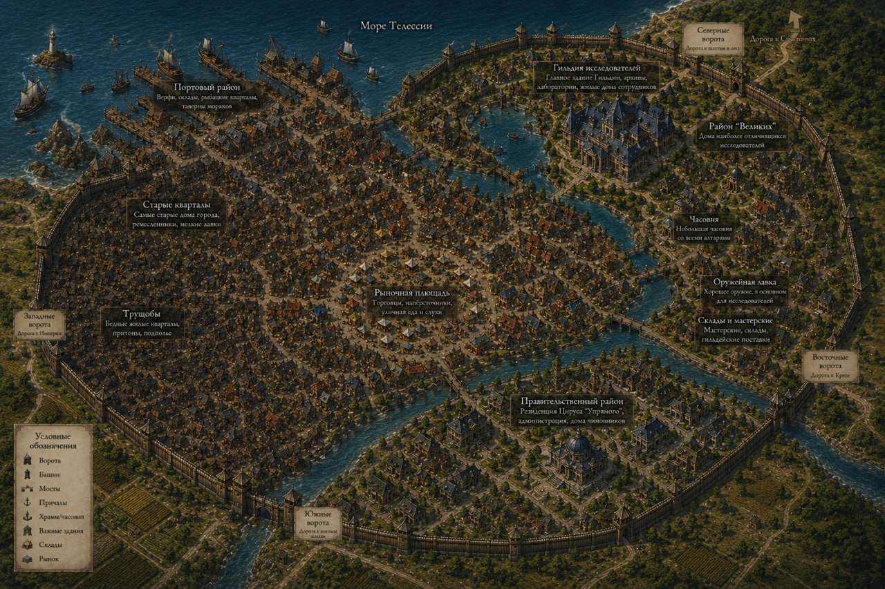

# Мир и сеттинг — от мастера

Вводные мастера, как их получили игроки перед первой сессией (часть сообщений мастер переслал из другого чата). Текст мастера; правки только в оформлении.

## Завязка

Существует город-государство, неподалеку от которого находится подземелье, конца и края которому пока никто не видел, в этот город стекаются люди всех мастей, но чаще туда попадают за преступления или скрываясь от закона, в редких случаях ради шанса разбогатеть на сокровищах подземелья или стать знаменитым. Вы-те кто по тем или иным причинам были вынуждены так же прибыть в это место

## Тристиам и Фенрис

Мир-Телессия. Континент Энейлез. Вы находитесь в городе «Тристиам», город-государство является нейтральной территорией, находящейся между враждующими друг с другом, «Серебрянной империей», управляемой людьми и королевством «Креса», в которой преобладающим большинством жителей являются зверолюди. Город примечателен наличием нескольких рудных шахт, и одного древнего подземелья из которого время от времени выходят блуждающие монстры, и, кроме того, в строго определенное время появляется орда монстров, которые разоряют не только близлежащий город, но и территории двух стран. Из-за данной «особенности» местности власти двух стран пришли к соглашению, по которому обе страны отказываются от притязаний на данную территорию, включая все шахты город и сокровища подземелья, позволяя местным, независимым властям самостоятельно распоряжаться ресурсами. С другой стороны власти города обязуются «любой ценой» держать под контролем подземелье. Для того чтобы помочь им в этих целях(и избавиться от нежелательных элементов) страны присылают в Тристиам своих заключенных. Кроме того, сюда часто приходят разные отщепенцы и отбросы общества, разорившиеся крестьяне и ремесленники, утопающие в долгах и желающие быстро решить свои финансовые трудности за счет ресурсов подземелья, младшие дворянские дети, ищущие славы в приключениях и другие, не менее интересные личности посещают этот городок. 
Все это вам рассказал человек-старик по имени Фенрис, подсевший за ваш столик в таверне «Обидчивый дракон». Все вы незнакомцы из разных мест, и собрались за этим столом, так как у вас не было другого выбора, все остальные столики заняты другими людьми. Фенрис, сразу распознал в вас новичков, только прибывших в этот город и пока не знающих никого и ничего вокруг. Он оказался крайне разговорчивым, и, не смотря на то, что Вы особо ничего у него не спрашивали, сам рассказал вам об окрестностях и о себе. Он оказался бывшим военным, дезертировавшим из Имперской армии перед крупным сражением около 10 лет назад, и нашедшим укрытие в Тристиаме, в котором не действовали законы других стран. На жизнь он себе зарабатывает, в основном, работая старателем в медной шахте, близ города, но иногда, ходит и в подземелье, дабы разжиться различными диковинами, кои можно найти даже на верхних уровнях подземелья, пусть они и не столь ценны, как то, что приносят снизу. Однако, даже на самом верхнем уровне нужно постоянно смотреть в оба, так как повсюду установлены ловушки, монстры любят устраивать засады, да и спрятанные комнаты и проходы частенько радуют внимательного искателя приключений.

## Возрождение

вообще изначально была система возрождения, если случается ТПК, так что новых персов создавать не нужно, я как игрок всегда прикипал к своим персам, поэтому и игра моя основана на том, что перс по сути потерян не будет

однако возрождение не проходит даром и работает ТОЛЬКО в случае ТПК, если умерли не все.. то персонаж который умер не возродится коли его не реснут сопартийцы... или если остальные не умрут

## Расы

Ну вообще нет, но я не любитель всяких плазмоидов, слонов/птиц/табаксов — но это обсуждаемо.

## Страны Энейлеза

- Халифат Гарджанан-Правитель: Халиф Уман ибн Хасар «Ведомый Тьмой». Специфика страны: Развитая Алхимия. Преобладающее население: Люди. Нейтрал.
- Великое Герцогство Веймак-Правитель: Калегорм «Неназываемый». Специфика страны: Эльфийская магия и магические предметы. Преобладающее население Высшие Эльфы. Добро.
- Город-государство Тристиам - Правитель: Цирус «Упрямый», Специфика страны, добыча и продажа ресурсов из шахт, торговля магическими предметами, контроль над подземельем. Преобладающее население: Нет. Нейтрал.
- Бамбугская Империя – Правитель Карайлин Хэлвивал(жен.) «Молотобоец». Специфика страны: религия, контроль над подземельем. Преобладающее население: Дроу. Нейтрал-Зло.
- Деспатат Лефаро – Правитель: Артауус «Хозяин Рун». Специфика страны. Создание магических свитков, начертание. Сюзерен: Королевство Херган. Проебладающее население: Дракониды. Зло.
- Княжество Дивароз – Правитель: Миарус «Умиротворитель». Специфика страны, торговля. Преобладающее население: Полуэльфы. Нейтрал-Хаот.
- Королевство Креса – Правитель: Крог «Жестокий». Специфика страны. Ненавидимы всеми, охота, кожевничество, ремесло. Сузерен: Герцогство Лосия. Преобладающее население: Зверолюды. Нейтр-Зло.
- Королевство Салкес – Правитель: Минос I «Владыка Шторма». Специфика страны: Кораблестроение, обработка древесины, ремесло. Преобладающее население гномы, хафлинги. Нейтр-Добро.
- Королевство Стрейн – Правитель: Элдея(жен.) «Скиталец». Специфика страны: институт магии, магические исследования. Преобладающее население: Эльфы. Нейтрал.
- Княжество Варбия – Правитель: Варос «Тихий». Специфика страны: добыча всевозможных горных ресурсов, инженерное дело. Преобладающее население: Дварфы.
- Серебряная империя – Правитель: Юлиус «Бог войны». Специфика страны: военная диктатура, кузнечество, боевые искусства. Сузерен: Герцогство Булдалмия. Преобладающее население: Люди. Нейтрал-Зло
- Герцогство Булдалмия – Правитель: Ерен Войц «Сломленный». Специфика страны: добыча, обработка драгоценных камней и металлов. Вассал: Серебряная Империя. Преобладающее население: Тифлинги. Добро.
- Королевство Херган – Правитель: Арулет ар Фет «Завоеватель». Специфика страны: торговля живым «товаром». Преобладающее население: Полуорки. Зло.
- Герцогство Лосия – Правитель: Имиль «Ремесленник». Специфика страны: все виды профессиональной деятельности, от обработки кожи, до алхимических и магических исследований. Вассал: Королевство Креса. Преобладающее население: Зверолюди, гномы. Нейтрал.
- Герцогство Порвус – Правитель: Релонрал из дома Годдис «Делец». Специфика страны. Добыча и создание магических предметов, торговля. Преобладающее население: Дроу. Зло
- Демобиранский Альянс: Правитель: Совет 3 расс. Специфика: Добыча ресурсов, ремесло. Преобладающее население: Хафлинги,гномы,дворфы. Нейтрал

## Окрестности Тристиама

жаль у меня не сохранились карты с природным фильтром(или как правильно, короче где леса, поля, горы показывает), но по сути территория города-государства это примерно 30-50 км радиусом, до собора(подземелье), на телеге обычно путь занимает 2 часа(пешком 4 часа). Помимо этого имеется 2 действующие шахты, в которых трудятся как каторжники, так и свободные старатели, которые хотят подзаработать, помимо этого территория практически не возделывается, поля имеются только севернее города и совсем небольшие, остальная территория преимущественно лесистая. В лесах не редко можно встретить как лагеря всяких бандитов, так и какие-нибудь развалины, помимо этого есть еще парочка заброшенных шахт путь к которым уже давно зарос.

На карте окрестностей две действующие шахты — медная (к юго-западу от города) и серная (к северо-западу); Звенящий собор — к югу, по реке.

## Город

Карта района Гильдии (основной район) делалась около 7 лет назад, что-то может быть изменено.

## Известные имена

- Цирус - Правитель Тристиама
- Молли- Регистраторша Гильдии
- Фалко- Регистратор Гильдии
- Норманн-Мастер Гильдии
- Рергамар- Наставник Гильдии
- Эла- Владелица Таверны
- Азрамус- Продавец оружия
- Годфрен- Столяр
- Анариель - Зельевар

По предыстории вы вольны придумать кого-то еще, если ваш персонаж уже жил в городе и кого-то знал

## Ответы мастера по свиткам

- **Уровень заклинателя в свитках.** Здесь не используются уровни заклинателя при определении эффектов заклинаний — речь об уровнях ячеек: бонус +N поднимает заклинание на N уровней ячейки.
- **Знают ли персонажи, что свиток нестабилен.** Если создатель после создания не поленится перепроверить — будут знать; если скажет «и так сойдёт» — вероятно, нет.
